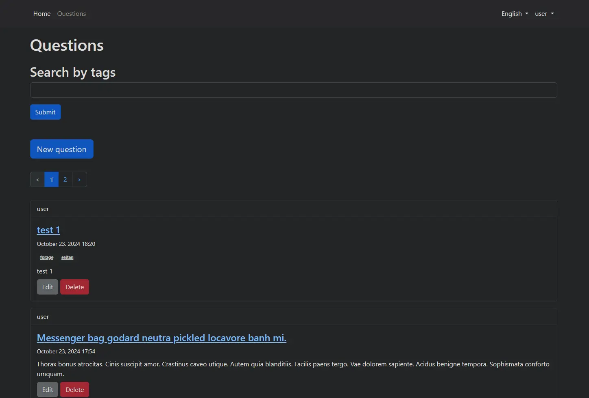

# Rails-app-by-guide (web-site)

### Video preview:

### Website:
https://rails-app-by-guide.onrender.com

### Description:
A training project completed using video lectures and repeating the original project of the author: https://www.youtube.com/@IlyaBodrovKrukowski.

### Resources used:
- https://github.com/bodrovis-learning/RailsSeriesYT/tree/lesson_25/app
- https://www.youtube.com/playlist?list=PLWlFXymvoaJ_IY53-NQKwLCkR-KkZ_44-
- https://render.com
